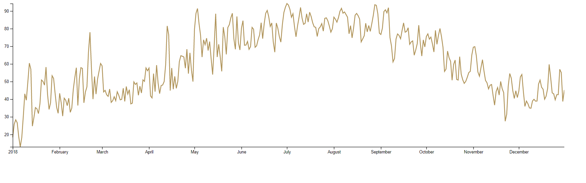

# Line Chart

This is a Line Chart Example from Amelia Wattenberger FullStack. Its a line graph of weather day for the year of 2018.

## Data Visualization

## Technologies 

HTML,D3.js, npm package live-server

## Installation

`git clone https://github.com/zaynaib/dataVizPractice`

## How to Run App

In order to run this app install npm package live server.

Navigate to Day 1 folder. In the Day 1 bash command line type `npm live-server`.
The app should run in your default browser `localhost:8080`

