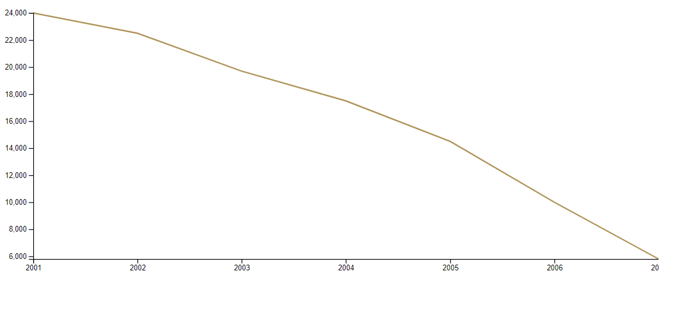

# 30 Days Of Data Viz - Log

## Table of Contents

- [30 Days Of Data Viz - Log](#30-days-of-data-viz---log)
  - [Table of Contents](#table-of-contents)
  - [Day 0: July 18, 2020](#day-0-july-18-2020)
  - [Day 1: July 19, 2020, Sunday](#day-1-july-19-2020-sunday)
  - [Day 2: July 20, Monday](#day-2-july-20-monday)
  - [Day 3: July 21, Tuesday](#day-3-july-21-tuesday)
  - [Day 4: July 22, Wednesday](#day-4-july-22-wednesday)
  - [Day 5: July 23, Thursday](#day-5-july-23-thursday)

 

## Day 0: July 18, 2020 

**Today's Progress**: I revamp my dataVizPractice repo for my 30 days of D3.js challenge.

**Emotion:** 

## Day 1: July 19, 2020, Sunday

**Today's Progress**:  Made my first d3 data visualization for this 30 day challenge. It was a line graph of weather day for the year of 2018. Finished half of chapter 1 of Amelia's book. 

**Emotion:**

**Photo of what I made**

**What I Learned Today**: 

[Async/Await](https://developer.mozilla.org/en-US/docs/Learn/JavaScript/Asynchronous/Async_await)

What does Async and await do 

Async/await makes your code look synchronous, and in a way it makes it behave more synchronously. The await keyword blocks execution of all the code that follows until the promise fulfills, exactly as it would with a synchronous operation.

**CORS Error**

CORS is short for Cross-Origin Resource Sharing, a mechanism used to restrict
requests to another domain

[Accessor Functions](https://stackoverflow.com/questions/26330927/what-is-accessor-function)

Also known as mutator methods.

An accessor property is one that is defined in terms of getters and setters, not as a stored value that might be written to. The "pair of accessor functions" denotes the getter and the setter function.

Margin Conventions:
https://observablehq.com/@d3/margin-convention

*Key Concepts to D3.js*

Think of D3.js similar to The Grammar of Graphics.
Hadley Wickham wrote a great paper about this book. 
https://vita.had.co.nz/papers/layered-grammar.html

Essentially think of a graph like a photo in photoshop.
Photoshop uses layers in order to create a beautiful image.
Its a similar to D3.js. 

1. Access the Data
2. Set up your getters and setter functions /Accessors for your data
3. Set the dimensions of your chart(Check out Margin Conventions)
4. Draw the canvas - add SVG to HTML
5. set up your scales
6. Draw the graph
7. Draw the axis

**Link(s) to work**: [First Graph](./Day1)

**To Do**:
Practice creating a basic line chart from a basic dataset.

**Resources**

Basic Datasets : 
http://veekaybee.github.io/2018/07/23/small-datasets/

https://vincentarelbundock.github.io/Rdatasets/datasets.html

https://www.kaggle.com/rtatman/fun-beginner-friendly-datasets

## Day 2: July 20, Monday

**Today's Progress**: Decided to apply what I learned on a data set that was not given from the book. I found a website that teaches basic math skills to childern 
https://www.mathgoodies.com/lessons/graphs/line .

 Lets see how this goes.

**Emotion**

**Thoughts** I've been procrastinating a lot today. 😭

## Day 3: July 21, Tuesday

**Today's Progress**: I spent today finishing up the data visualization that I had in mind for Day 2.  I'm glad I choose a simple dataset from that children's website. It took me awhile to do some data munging. Most definitely need practice with python regex, reading and writing files. After I got the data cleaning part down everything else fell into place.

**Photo of Wha

**Emotion**

**Thoughts** :
Making sure that I work on this challenge earlier in the day makes it easier to actually do the thing. 

For the rest of this challenge I'm going to try to take it slow and break each part into a concepts. So, my game plan moving forward is to time block my studying of D3.js into two hours.

1 hour will be for studying concepts. The 2nd hour will be for executing those concepts into practice.

**Link(s) to work**
[Second Graph](./Day2)

## Day 4: July 22, Wednesday

**Today's Progress**: I did not do anything today. 

**Photo of What I did today**

It's blank because I did do anything today.

**Emotion**

**Today I Learned (TIL)**:

I reviewed the Margin Convention in D3.js. It still confuses me. But basically the Margin Convention is a way to add room for axis labels and ticks for our data visualization. 

Logic flow of creating Margins:

//Setup the height and width of the entire graph. This will include axes.

width = 941
height = 500

//set up room for your margins using css properties.

margin = ({top: 20, right: 30, bottom: 30, left: 40})

//then subtract the margins from the width and height of your chart.

xAxis = g => g
    .attr("transform", `translate(0,${height - margin.bottom})`)
    .call(d3.axisBottom(x))

**Thoughts** :

I played myself today. If I wait until the end of the day I will have no motivation to create a data viz.

**Link(s) to work**

**Resources**:

[The D3.js Margin Convention Curran Kelleher](https://www.youtube.com/watch?v=M3YsZZidQXQ)

[Tyler Wolf 25 days of D3.js](https://observablehq.com/@thetylerwolf/25-days-of-d3)

[Mike Bostock Margin Convention](https://observablehq.com/@d3/margin-convention)

## Day 5: July 23, Thursday

**Today's Progress**: I did not do anything today. 

**Photo of What I did today**

It's blank because I did do anything today.

**Emotion**

**Today I Learned (TIL)**:

what is d3.extent?

Is a d3 helper function that finds the minmum and maximum values of a dataset. The parameters it takes is a dataset and an accessor function.

how does css transform work?

I learned what joins are.

what is a call >

Accessors 

https://observablehq.com/@thetylerwolf/day-3-controlling-the-flow-of-data?collection=@thetylerwolf/25-days-of-d3

**Thoughts** :

I played myself today. If I wait until the end of the day I will have no motivation to create a data viz.

**Link(s) to work**

**Resources**:

[David Walsh Blog 5 Cruical Concepts to know when working with D3.js](https://davidwalsh.name/learning-d3)

[Mike Bostock Data Join](https://observablehq.com/@d3/selection-join)