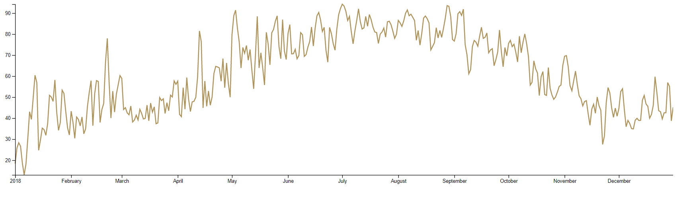

# 30 Days Of Data Viz - Log

## Table of Contents

  [Table of Contents](#table-of-contents)
- [30 Days Of Data Viz - Log](#30-days-of-data-viz---log)
  - [Table of Contents](#table-of-contents)
  - [Day 0: July 18, 2020](#day-0-july-18-2020)
  - [Day 1: July 19, 2020, Sunday](#day-1-july-19-2020-sunday)
    - [Day 2: July 20, Monday](#day-2-july-20-monday)

 

## Day 0: July 18, 2020 

**Today's Progress**: I revamp my dataVizPractice repo for my 30 days of D3.js challenge.

**Emotion:** 

## Day 1: July 19, 2020, Sunday

**Today's Progress**:  Made my first d3 data visualization for this 30 day challenge. It was a line graph of weather day for the year of 2018. Finished half of chapter 1 of Amelia's book. 

**Emotion:**

**Photo of what I made**

**What I Learned Today**: 

[Async/Await](https://developer.mozilla.org/en-US/docs/Learn/JavaScript/Asynchronous/Async_await)

What does Async and await do 

Async/await makes your code look synchronous, and in a way it makes it behave more synchronously. The await keyword blocks execution of all the code that follows until the promise fulfills, exactly as it would with a synchronous operation.

**CORS Error**

CORS is short for Cross-Origin Resource Sharing, a mechanism used to restrict
requests to another domain

[Accessor Functions](https://stackoverflow.com/questions/26330927/what-is-accessor-function)

Also known as mutator methods.

An accessor property is one that is defined in terms of getters and setters, not as a stored value that might be written to. The "pair of accessor functions" denotes the getter and the setter function.

Margin Conventions:
https://observablehq.com/@d3/margin-convention

*Key Concepts to D3.js*

Think of D3.js similar to The Grammar of Graphics.
Hadley Wickham wrote a great paper about this book. 
https://vita.had.co.nz/papers/layered-grammar.html

Essentially think of a graph like a photo in photoshop.
Photoshop uses layers in order to create a beautiful image.
Its a similar to D3.js. 

1. Access the Data
2. Set up your getters and setter functions /Accessors for your data
3. Set the dimensions of your chart(Check out Margin Conventions)
4. Draw the canvas - add SVG to HTML
5. set up your scales
6. Draw the graph
7. Draw the axis

**Link(s) to work**: [First Graph](./Day1)

**To Do**:
Practice creating a basic line chart from a basic dataset.

**Resources**

Basic Datasets : 
http://veekaybee.github.io/2018/07/23/small-datasets/

https://vincentarelbundock.github.io/Rdatasets/datasets.html

https://www.kaggle.com/rtatman/fun-beginner-friendly-datasets

### Day 2: July 20, Monday

**Today's Progress**: Decided to apply what I learned on a data set that was not given from the book. I found a website that teaches basic math skills to childern 
https://www.mathgoodies.com/lessons/graphs/line .

 Lets see how this goes.

**Emotion**

**Thoughts** I've been procrastinating a lot today. 😭

**Link(s) to work**
1. [Find the Longest Word in a String](https://www.freecodecamp.com/challenges/find-the-longest-word-in-a-string)
2. [Title Case a Sentence](https://www.freecodecamp.com/challenges/title-case-a-sentence)